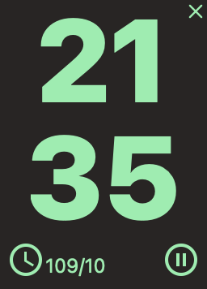
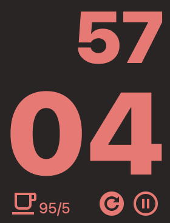

# pomodoro
A simple pomodoro timer write in Tauri and Vue3.

[Click to Download](https://github.com/andycai/pomodoro/releases)

- [macOs](https://github.com/andycai/pomodoro-tauri-react/releases/download/v0.7.1/pomodoro_0.7.1_x64.dmg)
- [Windows](https://github.com/andycai/pomodoro-tauri-react/releases/download/v0.7.1/pomodoro_0.7.1_x64-setup.exe)
- [Linux](https://github.com/andycai/pomodoro-tauri-react/releases/download/v0.7.1/pomodoro_0.7.1_amd64.deb)

## Screenshots





# Tauri + Vue 3 + TypeScript

This template should help get you started developing with Vue 3 and TypeScript in Vite. The template uses Vue 3 `<script setup>` SFCs, check out the [script setup docs](https://v3.vuejs.org/api/sfc-script-setup.html#sfc-script-setup) to learn more.

## Recommended IDE Setup

- [VS Code](https://code.visualstudio.com/) + [Volar](https://marketplace.visualstudio.com/items?itemName=Vue.volar) + [Tauri](https://marketplace.visualstudio.com/items?itemName=tauri-apps.tauri-vscode) + [rust-analyzer](https://marketplace.visualstudio.com/items?itemName=rust-lang.rust-analyzer)

## Install Tauri support

```bash
pnpm i
```

## run project

```bash
pnpm run tauri dev
```

## Build project

```bash
pnpm run tauri build
`````