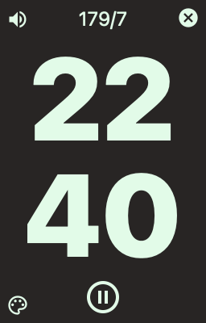

# pomodoro
A simple pomodoro timer write in Tauri and Vue3.

## Screenshots




# Tauri + Vue 3 + TypeScript

This template should help get you started developing with Vue 3 and TypeScript in Vite. The template uses Vue 3 `<script setup>` SFCs, check out the [script setup docs](https://v3.vuejs.org/api/sfc-script-setup.html#sfc-script-setup) to learn more.

## Recommended IDE Setup

- [VS Code](https://code.visualstudio.com/) + [Volar](https://marketplace.visualstudio.com/items?itemName=Vue.volar) + [Tauri](https://marketplace.visualstudio.com/items?itemName=tauri-apps.tauri-vscode) + [rust-analyzer](https://marketplace.visualstudio.com/items?itemName=rust-lang.rust-analyzer)

## Install Tauri support

```bash
npm create tauri-app@latest
npm install --save-dev @tauri-apps/cli@latest
npm install
```

## run project

```bash
npm run tauri dev
```

## Build project

```bash
npm run tauri build
`````